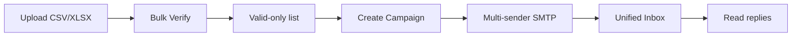

<div align="center">

# MailForge

**Verify. Send. Inbox.** — one private email operations dashboard.

Self-hosted list verification with **live SMTP proof**, multi-account campaigns, and a unified reply inbox.

<br/>

[](https://nodejs.org/)
[](https://go.dev/)
[](https://www.docker.com/)
[](LICENSE)

</div>

---

## Why MailForge?

| | Paid SaaS stack | **MailForge** |
|---|-----------------|---------------|
| Cost | Per email / seat | **$0** |
| Data | Third-party servers | **Stays on your machine** |
| SMTP proof | Sometimes | **Yes** — RCPT dialog + 550 text |
| Campaigns | Separate tool | **Built in** |
| Replies | Another inbox app | **Unified inbox** |

---

## Features

- **Email verification** — syntax, MX, disposable/role checks, live SMTP mailbox dialog
- **Bulk CSV / XLSX** — finds emails in any column; valid-only export
- **Campaigns** — create from verified lists; multi-Gmail rotation; delays, retries, warm-up
- **Templates** — merge fields: `{Name}`, `{Email}`, `{State}`, `{COMPANY_NAME}`, etc.
- **Unified inbox** — IMAP sync from sender accounts; campaign reply matching
- **JWT auth**, dark mode, per-user settings

---

## Verification engine (recommended)

MailForge uses **truemail-go** as the primary engine — it performs a real SMTP RCPT dialog and captures the **server response text** (550, 250, etc.). This is the best choice when you need to see what the mail server actually said.

| Engine | SMTP response | Speed | Best for |
|--------|---------------|-------|----------|
| **truemail-go** (default) | Full 550/250 text | Fast | Most domains, bulk lists |
| **Reacher** (optional Docker) | Headless checks | Slower | Gmail, Outlook, hard providers |
| **auto** (recommended) | truemail first, Reacher fallback | Balanced | Production use |

Set in `.env`:

```env
VERIFIER_ENGINE=auto
```

Optional Reacher (Docker):

```bash
docker compose up -d
```

---

## Quick start (Windows)

### Prerequisites

- [Node.js](https://nodejs.org/) 18+
- [Go](https://go.dev/dl/) 1.22+ (for truemail-go verifier)

### Install & run

```powershell
cd MailForge
copy .env.example .env
npm run setup
npm start
```

Open **http://localhost:5000** → register → start verifying.

One-command start (Node + Go verifier):

```powershell
npm run start:all
```

---

## Workflow



1. **Bulk Verify** — upload your list
2. **History** — click the plane icon → **Create Campaign**
3. **Senders** — add Gmail accounts (App Passwords)
4. **Templates** — customize outreach copy
5. **Campaigns** — start and monitor sends
6. **Inbox** — sync and read replies

---

## Tech stack

```
Browser → Node.js + Express (:5000)
              ├── MongoDB (or in-memory dev)
              ├── truemail-go (:8082) — SMTP verification
              ├── Reacher Docker (:8081) — optional fallback
              ├── nodemailer — campaign sending
              └── imapflow — inbox sync
```

---

## Environment variables

| Variable | Default | Description |
|----------|---------|-------------|
| `PORT` | `5000` | Web UI port |
| `JWT_SECRET` | — | Auth signing key |
| `MONGO_URI` | (in-memory) | MongoDB connection string |
| `VERIFIER_ENGINE` | `auto` | `auto`, `truemail`, or `reacher` |
| `GO_VERIFIER_URL` | `http://localhost:8082` | truemail-go API |
| `ENCRYPTION_KEY` | — | Encrypts sender credentials |

See [`.env.example`](.env.example) for all options.

---

## GitHub repository

When creating your repo on GitHub, use:

| Field | Value |
|-------|-------|
| **Repository name** | `mailforge` |
| **Description** | Self-hosted email operations platform — verify lists with live SMTP proof, run multi-sender campaigns, and manage every reply from one unified inbox. Free, private, no SaaS APIs. |
| **Topics** | `email-verification`, `smtp`, `email-marketing`, `self-hosted`, `nodejs`, `campaigns`, `inbox` |

---

## License

MIT — see [LICENSE](LICENSE).
