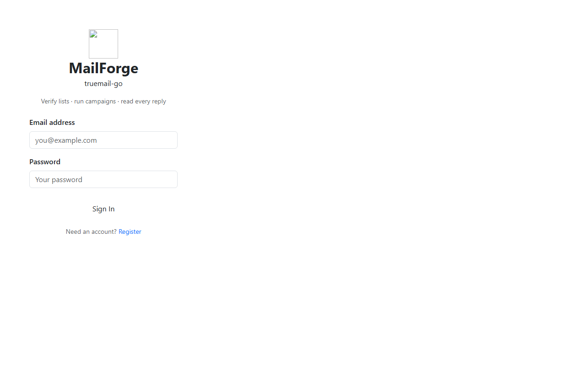
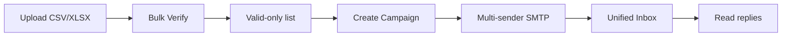

<div align="center">

# MailForge

**Verify. Send. Inbox.** — one private email operations dashboard.

Self-hosted list verification with **live SMTP proof**, multi-account campaigns, and a unified reply inbox.

<br/>

[](https://nodejs.org/)
[](https://go.dev/)
[](https://www.docker.com/)
[](LICENSE)

</div>

---

## Why MailForge?

| | Paid SaaS stack | **MailForge** |
|---|-----------------|---------------|
| Cost | Per email / seat | **$0** |
| Data | Third-party servers | **Stays on your machine** |
| SMTP proof | Sometimes | **Yes** — RCPT dialog + 550 text |
| Campaigns | Separate tool | **Built in** |
| Replies | Another inbox app | **Unified inbox** |

---

## Screenshots



## Features

### Verification
- **Live SMTP verification** — syntax, MX, disposable/role checks, real RCPT dialog
- **Strict SMTP validity** — 550/553/503 rejections and IP-block responses are **never** marked valid; blocked checks show as `unknown`
- **Backend bulk jobs** — upload CSV/XLSX, verification runs on the server; switch tabs freely
- **Pause / resume / stop** — control long-running verify jobs without losing progress
- **Bulk CSV / XLSX** — finds emails in any column; valid-only export

### Campaigns & sending
- **Verify → send pipeline** — auto-redirect to campaign creator when verification completes (toggle in Settings)
- **Create from verified lists** — valid-only recipients with original CSV columns preserved
- **Multi-Gmail rotation** — delays, retries, warm-up, bulk sender import
- **Create & start** — launch a campaign in one click from the wizard

### Templates
- **10 Freight Outreach templates** — imported from the original Auto Emailer (INDUS Transports)
- **Combined freight pack** — all 10 subjects + 10 bodies in one template for random rotation
- **Merge fields** — `{Name}`, `{Email}`, `{State}`, `{SENDER_NAME}`, `{SENDER_EMAIL}`, `{COMPANY_NAME}`
- **AI template generator** — Groq (free), OpenRouter, or OpenAI for spam-safe copy
- **Edit & manage** — full CRUD from the Templates page or inline in campaign create

### Inbox & platform
- **Unified inbox** — view all sender accounts together or filter by one Gmail account
- **Reply from inbox** — send threaded replies from the same sender account (In-Reply-To headers)
- **Unread / Starred / Important** — filter pills and toggle on each message
- **Per-account sync** — sync a single mailbox or all accounts at once
- **JWT auth**, dark mode, per-user settings

### Deliverability & compliance (v1.2)
- **Suppression list** — block bounces, unsubscribes, and manual blocks from all campaigns
- **Auto bounce suppression** — failed sends with bounce-like SMTP errors are added automatically
- **Unsubscribe links** — optional footer in every campaign email with one-click opt-out page
- **Scheduled campaigns** — set a future start time; background scheduler launches them automatically
- **Campaign analytics** — reply rate, replies over time, performance by sender account
- **Sender health dashboard** — sent today vs daily limit per Gmail account
- **Onboarding checklist** — guided setup on first login

### DevOps (v1.2)
- **Docker full stack** — `docker compose -f docker-compose.full.yml up -d` (MongoDB + app)
- **CI pipeline** — Node tests + Go build on every push
- **Screenshot script** — `node scripts/capture-screenshots.js` for README assets

---

## Verification engine (recommended)

MailForge uses **truemail-go** as the primary engine — it performs a real SMTP RCPT dialog and captures the **server response text** (550, 250, etc.). Results are post-processed so reject codes like `550 5.7.1 Service unavailable` or `553 TSS09` are not counted as valid.

| Engine | SMTP response | Speed | Best for |
|--------|---------------|-------|----------|
| **truemail-go** (default) | Full 550/250 text | Fast | Most domains, bulk lists |
| **Reacher** (optional Docker) | Headless checks | Slower | Gmail, Outlook, hard providers |
| **auto** (recommended) | truemail first, Reacher fallback | Balanced | Production use |

Set in `.env`:

```env
VERIFIER_ENGINE=auto
```

Optional Reacher (Docker):

```bash
docker compose up -d
```

---

## Quick start (Windows)

### Prerequisites

- [Node.js](https://nodejs.org/) 18+
- [Go](https://go.dev/dl/) 1.22+ (for truemail-go verifier)

### Install & run

```powershell
cd MailForge
copy .env.example .env
npm run setup
npm start
```

Open **http://localhost:5000** → register → start verifying.

### Docker (production-style)

```bash
docker compose -f docker-compose.full.yml up -d
```

This starts **MongoDB** and the **MailForge app** on port 5000. Run truemail-go on the host at `:8082`, or add the Reacher profile:

```bash
docker compose -f docker-compose.full.yml --profile reacher up -d
```

One-command start (Node + Go verifier on Windows):

```powershell
npm run start:all
```

### Optional: AI templates

**Groq (free tier, recommended)** — get a key at [console.groq.com](https://console.groq.com):

```env
AI_PROVIDER=groq
GROQ_API_KEY=gsk_your_key_here
```

Also supports **OpenRouter** (free models) and **OpenAI**. Configure in **Settings → AI & workflow** or via `.env`.

---

## Workflow



1. **Bulk Verify** — upload your list; pause/resume as needed
2. **Auto-redirect** — when done, opens Create Campaign with the verified list loaded
3. **Templates** — pick a starter template or generate spam-safe copy with AI
4. **Senders** — add Gmail accounts (App Passwords) or bulk import
5. **Create & Start** — launch the campaign
6. **Inbox** — sync and read replies

You can also go **History → plane icon → Create Campaign** at any time.

---

## API highlights

| Endpoint | Description |
|----------|-------------|
| `POST /api/verify/jobs` | Start backend bulk verify (CSV/XLSX upload) |
| `POST /api/verify/jobs/:id/pause` | Pause a running job |
| `POST /api/verify/jobs/:id/resume` | Resume a paused job |
| `POST /api/verify/jobs/:id/cancel` | Stop a job |
| `POST /api/campaigns/from-bulk-job` | Create campaign from verified list |
| `POST /api/inbox/:id/reply` | Send threaded reply from inbox |
| `GET /api/campaigns/:id/analytics` | Campaign reply rate & charts |
| `GET /api/dashboard/overview` | Command center stats + onboarding |
| `GET /api/suppression` | Suppression list CRUD |
| `POST /api/suppression/unsubscribe` | Public one-click unsubscribe |

---

## Tech stack

```
Browser → Node.js + Express (:5000)
              ├── MongoDB (or in-memory dev)
              ├── truemail-go (:8082) — SMTP verification
              ├── Reacher Docker (:8081) — optional fallback
              ├── nodemailer — campaign sending
              ├── imapflow — inbox sync
              └── OpenAI API — optional AI templates
```

---

## Environment variables

| Variable | Default | Description |
|----------|---------|-------------|
| `PORT` | `5000` | Web UI port |
| `JWT_SECRET` | — | Auth signing key |
| `MONGO_URI` | (in-memory) | MongoDB connection string |
| `VERIFIER_ENGINE` | `auto` | `auto`, `truemail`, or `reacher` |
| `GO_VERIFIER_URL` | `http://localhost:8082` | truemail-go API |
| `ENCRYPTION_KEY` | — | Encrypts sender credentials |
| `OPENAI_API_KEY` | — | Optional — OpenAI template generation |
| `GROQ_API_KEY` | — | Optional — Groq free tier (recommended) |
| `AI_PROVIDER` | `groq` | `groq`, `openrouter`, or `openai` |
| `APP_BASE_URL` | `http://localhost:5000` | Public URL for unsubscribe links |

See [`.env.example`](.env.example) for all options.

Per-user overrides (verifier URLs, OpenAI key, auto-redirect after verify) are available in **Settings**.

---

## GitHub repository

**https://github.com/mafzalkalwardev/mailforge**

| Field | Value |
|-------|-------|
| **Repository name** | `mailforge` |
| **Description** | Self-hosted email operations platform — verify lists with live SMTP proof, run multi-sender campaigns, and manage every reply from one unified inbox. Free, private, no SaaS APIs. |
| **Topics** | `email-verification`, `smtp`, `email-marketing`, `self-hosted`, `nodejs`, `campaigns`, `inbox` |

---

## License

MIT — see [LICENSE](LICENSE).
